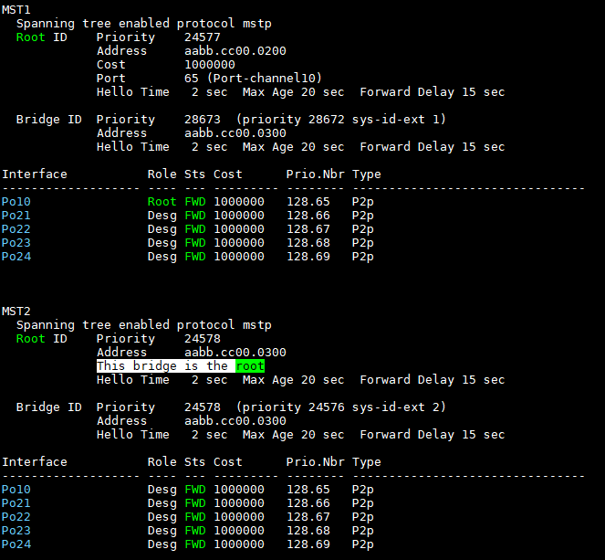
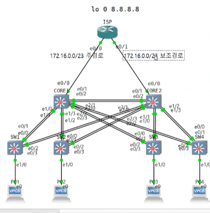

Static_routing_switching_FHRP 연습문제
===


#### 문제

1. PC1-4번까지는 약 200대 정도의 사용자들이 연결되어 있음. B class의 사설 IP 대역을 이용해 모든 사용자들이 서로 통신이 되도록 수량에 맞춘 서브넷팅을 사용
2. VLAN은 서브넷팅한 IP 주소를 기준으로 VLAN을 부여해 서로 다른 네트워크의 브로드캐스트가 다른 네트워크에 전달되지 않도록 하세요 (VTP를 활용)
3. Core1 스위치는 PC1, PC2가 통신 시 Root SW가 되도록 하고 Core2 스위치는 Core1 스위치가 down되었을때 root SW가 되도록 하세요(MSTP사용)
4. Core2 스위치는 PC3, PC4가 통신 시 Root SW가 되도록 하고 Core1 스위치는 Core2 스위치가 down되었을때 root SW가 되도록 하세요(MSTP 사용)
5. PC가 연결된 곳은 PC1, PC2는 스위치 접속을 차단하도록 하고 PC3, PC4가 연결된 곳은 root sw보다 좋은 BPDU가 들어오는 경우 차단하도록 설정하세요  --> SW1, SW2엔 bpduguard / SW3, SW4엔 rootguard  --> SW를 새로 연결해서 테스트 가능   
   (600초 후 자동 복구 시도 하도록 설정)  ---> error disable recovery
6. PC가 연결된 곳은 BPDU를 전송하지 않도록 설정하고 빠른 STP 수렴이 되도록 하세요.
7. PC가 연결 된 곳은 MAC 주소 학습을 최대 2개까지만 허용하세요
8. Core1과 Core를 연결한 곳은 정적링크 통합을 활용하고 Core1과 SW1, SW2, SW3, SW4는 동적 링크 통합 중 PAgP를 사용, Core2와 SW1, SW2, SW3, SW4은 동적링크 통합 중 LACP를 사용하도록 설정
9. SW1-4번은 L2 스위치로 (config)#no ip routing을 하세요 (L2 Switch로 작동)
10. R1에 입력된 IP주소를 참조해 Core1과 Core2에 8.8.8.8(인터넷)과 통신이 되도록 routing을 하고(Inter-VLAN) PC에서 8.8.8.8로 ping이 되어야 하며 CORE1, CORE2가 각각 장애를 일으켰을 때도 통신이 되도록 설정하시오 --> MSTP 사용

- - -
#### 기본 설정

- Router 기본 설정


- Switch 기본 설정

```
(config)# hostnamectl set-hostname SW1
(config)# banner motd&
###############################
#### authorized person only ! ###
###############################
&
(config)# banner login % ### login ### %

(config)# clock timezone KST9
(config)# ntp server 216.239.35.8
(config)# enable secret 1234
(config)# username kedu00 privilege 15 password 1234

(config)# line con 0
(config)# exec-timeout 0 0
(config)# password 1234
(config)# login

(config)# line vty 0 4
(config)# exec-timeout 3 30
(config)# login local

(config)# logging synchronous
(config)# transport input telnet ssh

(config)# no ip domain-lookup
(config)# ip name-server 8.8.8.8
```

- 링크통합(PAgP)

   

- 정적 링크통합


- CORE1 링크통합 확인   
```
# show etherchannel summary
```


- CORE2 링크통합


- SW1 링크통합 (PAgP에서 desirable <--> desirable 통신 가능. auto <--> auto 불가능)


- SW2 링크통합 (SW3, SW4도 CORE1, 2에 맞게 설정 --> PAgP, LACP)


- CORE1, CORE2 링크통합 확인


   
> in use 상태 확인

- 링크통합 전에 연결된 포트를 정확히 확인   
```
# show cdp neighbor
```


- 링크통합된 etherchannel 포트 확인


- Switch끼리 Trunk 설정


   
> CORE1, CORE2에서 한꺼번에 trunk 설정 (SW1~4 trunk 설정 할 필요 없다)

- Trunk 설정 확인

   
> CORE1 trunk 설정 확인

   
> SW1에서 trunk 설정 확인


- SW1 ~ SW4는 L2 Switch로 사용   
```
SW1(config)# no ip routing
```

- IP와 VLAN 설계


- VTP 설정

   
> CORE1과 CORE2는 VTP server

   
> SW1 ~ 4는 VTP client 설정


- VTP 확인   
```
# show vtp status
```

   
> 스위치 간 MD5 digest가 다르면 password가 일치하지 않는다는 오류 발생
>
> runk 설정부터 한 다음 VTP 설정 (password error 방지)


- VLAN

```
CORE1(config)# vlan 10-11

CORE2(config)# vlan 12-13
```

```
SW1(config)# int range e1/0-1
SW1(config-if-range)# switchport mode access
SW1(config-if-range)# switchport access vlan 10

SW2(config)# int range e1/0-1
SW2(config-if-range)# switchport mode access
SW2(config-if-range)# switchport access vlan 11

SW3(config)# int range e1/0-1
SW3(config-if-range)# switchport mode access
SW3(config-if-range)# switchport access vlan 12

SW4(config)# int range e1/0-1
SW4(config-if-range)# switchport mode access
SW4(config-if-range)# switchport access vlan 13
```


- 사용자 PC IP설정

```
PC1> ip 172.16.0.1/24 172.16.0.254

PC2> ip 172.16.1.1/24 172.16.1.254

PC3> ip 172.16.2.1/24 172.16.2.254

PC4> ip 172.16.3.1/24 172.16.3.254
```


- MSTP   
(모든 Switch에 입력)   
```
spanning-tree mode mst
spanning-tree mst configuration
name ddomung
revision 1
instance 1 vlan 10-11
instance 2 vlan 12-13
exit
```

- Core1에서 MSTP 확인

```
# show spanning-tree
```


- Root Switch 설정(mst)


   
> CORE1, CORE2에 Root Switch 설정 (mst 별로 분리)
>
> Root Switch : CORE1-mst1 / CORE2-mst2

  - Root Switch 확인   
       
    > CORE2은 mst2로 설정한 VLAN 12, 13에 한해서 Root Switch로 작성

- 게이트웨이 이중화 (HSRP)

   
> CORE1 standby 설정

   
> CORE2  standby 설정


- Routed port 설정 (Switch)

   
> 위처럼 라우터 인접 인터페이스의 IP 주소 설계

   

   
> CORE1, CORE2의 e0/0 인터페이스를 Routed port로 설정 및 IP 지정


- Static Routing

```
CORE1(config)# ip route 8.8.8.8 255.255.255.255 e0/0 172.16.254.1

CORE2(config)# ip route 8.8.8.8 255.255.255.255 e0/0 172.16.255.1
```

- ISP Router의 IP 지정


- IP SLA 정책 설정

```
CORE1(config)# ip sla 10
CORE1(config-ip-sla)# icmp-echo 172.16.254.1
CORE1(config-ip-sla)# frequency 5
CORE1(config-ip-sla)# exit
CORE1(config)# ip sla schedule 10 life forever start-time now
CORE1(config)# track 1 ip sla 10 reachability

CORE2(config)# ip sla 10
CORE2(config-ip-sla)# icmp-echo 172.16.255.1
CORE2(config-ip-sla)# frequency 5
CORE2(config-ip-sla)# exit
CORE2(config)# ip sla schedule 10 life forever start-time now
CORE2(config)# track 1 ip sla 10 reachability
```


- ISP Router에 IP SLA 설정 --> VLAN10, 11은 CORE1, VLAN 12, 13은 CORE2로 패킷 보내기 (주경로, 보조경로)

```
ISP(config)# ip sla 10
ISP(config-ip-sla)# icmp-echo 172.16.254.2
ISP(config-ip-sla)# frequency 5
ISP(config-ip-sla)# exit
ISP(config)# ip sla schedule 10 life forever start-time now
ISP(config)# track 1 ip sla 10 reachability

ISP(config)# ip sla 20
ISP(config-ip-sla)# icmp-echo 172.16.255.2
ISP(config-ip-sla)# frequency 5
ISP(config-ip-sla)# exit
ISP(config)# ip sla schedule 20 life forever start-time now
ISP(config)# track 1 ip sla 20 reachability
```


- Static Routing 주경로, 보조경로 설정



```markdown
#  track 1(VLAN 10,11) 주경로, 보조경로 설정
ISP(config)# ip route 172.16.0.0 255.255.254.0 e0/0 172.16.254.2 track 1

# AD 값 10
ISP(config)# ip route 172.16.0.0 255.255.254.0 e0/1 172.16.255.2 10
```

   
> 주경로가 끊겼을 떄

   
> 주경로 다시 연결됬을 때

```markdown
# track 2(VLAN 12,13) 주경로, 보조경로 설정
ISP(config)# ip route 172.16.2.0 255.255.254.0 e0/0 172.16.255.2 track 2
ISP(config)# ip route 172.16.2.0 255.255.254.0 e0/1 172.16.254.2 10
```


- ISP의 loopback 인터페이스 IP 지정

```
ISP(config)# int lo 0
ISP(config-if)# ip add 8.8.8.8 255.255.255.255
```

- portfast, bpdufilter, port-security
  SW1 ~ SW4에 설정

```
(config)# int range e1/0-1
(config-if)# spanning-tree portfast
(config-if)# spanning-tree bpdufilter enable
```

```md
# 학습 가능한 MAC 주소를 2개로 제한
(config-if)# switchport port-security
(config-if)# switchport port-security maximum 2
```

- bpduguard, rootguard   
  (SW1 ~ SW4의 e1/0, e1/1 인터페이스에 설정)

```
SW1(config-if-range)# spanning-tree bpduguard enable
SW2(config-if-range)# spanning-tree bpduguard enable
SW3(config-if-range)# spanning-tree guard root
SW4(config-if-range)# spanning-tree guard root
```

- err-disable   
  (SW1 ~ SW4 적용)

```
(config)# errdisable recovery cause bpduguard
(config)# errdisable recovery interval 600
```


