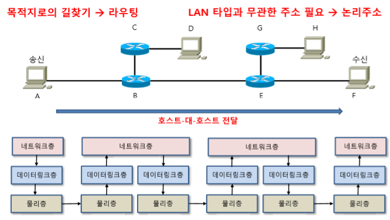

OSI 7 Layer
===
> ISO (국제표준화기구)에서 통신을 7개의 단계로 표준화하였음
> 전체 네트워크 시스템을 7개의 기능 계층으로 세분화하고 각 계층은 정형화된 기능을 수행하도록 구성

표준화 기구
---

#### 1. IETF (Internet Engineering Task Force)
**:** **RFC** (Request for Comments) 문서는 인터넷 기술에 적용 가능한 새로운 연구, 혁신, 기법 등을 아우르는 메모를 나타냄
* 3계층 이상의 프로토콜이 지정되어 있음
* RFC 791 : IP를 정의한 표준 문서
* RFC 1918 : 사설 IP 대역을 정의한 표준 문서 (Address Allocation for Private Internets)

#### 2. IEEE (Institute of Electrical and Electronics Engineers)
* 2계층 이하의 프로토콜이 지정되어 있음
* IEEE 802 : LAN, MAN 기술 정의
* IEEE 802.1, IEEE 802.2, IEEE 802.3 (ethernet 기술 정의), IEEE 802.11 (무선 LAN 기술 정의)

Protocol
---

#### 1. Protocol 이란?
* 네트워크상에 있는 디바이스 사이에서 정확한 데이터의 송신과 수신을 하기 위한 set of rules
* 네트워크 상에서 통신을 하기 위한 일종의 약속

* Protocol은 상위 계층에 대한 정보를 가지고 있다
* Protocol은 하위 계층으로 전달될 때 상위 계층의 정보를 갖는다
* Protocol은 단독으로 쓰이지 않고 반드시 Stack 구조를 갖는다. **(계층적 구조)** --> 캡슐화

#### 2. Protocol의 구성요소
* **구문 (syntax)** : 데이터의 형식(format),부호화 및 신호의 크기 등 무엇을 전송할 것인가에 관한 내용을 포함

* **의미 (semantics)** : 데이터의 특정한 형태에 대한 해석을 어떻게 할 것인가? 어떻게 동작을 취할 것인가? 등 전송의 조정 및 오류 처리를 위한 제어정보를 포함

* **타이밍 (timing)** : 언제 데이터를 전송? 얼마나 빠른 속도로 전송? 같은 내용을 포함

OSI 7 Layer
---

#### 1. L1 Physical Layer
* 상위 계층인 데이터링크 계층에서 형성된 데이터 패킷을 전기신호로 변환하여 송수신
* 허브, 라우터, 네트워크 카드, 케이블 등의 전송매체를 통해 **Bit**를 전송

#### 2. L2 Data Link Layer
* Physical Layer를 통해 송수신되는 정보의 오류와 흐름을 관리하여 안전한 정보의 전달을 수행할 수 있도록 도와주는 역할
* **Frame**의 형태로 정보 전달
* 전송하려는 데이터에 인접하는 node의 주소가 더해짐 --> 이 주소는 최종 수신지의 주소가 아니라 전송되는 다음 노드의 주소
* Encapsulation -> Network Layer에서 받은 packet을 frame으로 구성하여 하위 계층인 Physical Layer로 전송

##### Hop
: 두 개의 네트워크 node 사이의 데이터 패킷 통로 (ex. 2대의 Router 사이)

##### Hop by Hop 통신
* 같은 네트워크에서 이웃한 장비와의 통신. MAC주소만 다름

* 각 계층에서 주소 확인 시 나의(?) 주소이면 Header를 제거 후 상위 계층으로 전달 --> **Decapsulation**
  * L2 스위치는 MAC 주소를 확인하여 나의 주소가 아니면 다른 포트로 전달
  * 스위치를 제외한 모든 장비는 MAC주소가 나의 주소가 아니면 Drop
  * 라우터 (L3)는 IP 주소를 보고 Routing Table과 비교 후 해당 경로를 가진 Interface로 전달.

#### 3. L3 Network Layer
> Host by Host 통신 : 다른 Network와의 통신
* 데이터가 Source에서 Destination까지 가는 최적의 경로를 찾아주는 역할, 주소 지정
* Routing Protocol을 이용
* **packet** 이라는 단위로 데이터를 분할하여 전송 후 재결합
* 각 packet이 Source에서 최종 Destination까지 정확하게 전송되도록 경로를 지정.

#### 4. L4 Transport Layer
* 오류 복구, 흐름 제어
* Source : 데이터를 packet으로 분할
* Destination : 분할된 packet을 다시 결합하여 순서대로 재조립
###### => 2개의 프로세스 간의 데이터 전송을 위해 Session Layer에서 받은 데이터를 packet 단위로 분할하여 Network Layer로 전송

#### 5. L5 Session Layer
> L5 ~ L7은 소프트웨어가 제어
> TCP/IP 4계층에서 L5 ~ L7가 합쳐져 있어 특정한 장비는 없음

* 대화 제어, 동기화(Synchronization)
* 세션 설정, 유지, 종료
* 전송 단위 : message

#### 6. L6 Presentation Layer
* Application에서 사용하는 데이터의 형식, 암호화, 압축 등을 담당

#### 7. L7 Application Layer
* 사용자에게 Interface 및 service 제공
* FTP, 웹 브라우저 등

