TCP/IP 4 Layer
===
> TCP/IP 프로토콜은 계층의 경계가 완전히 분리되어 있지 않다.

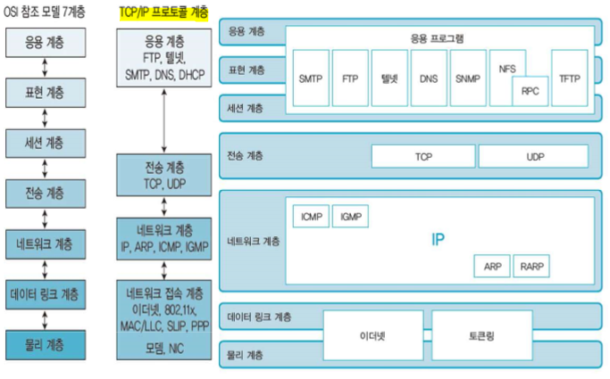

TCP/IP - Application Layer (응용계층)
---

* Application으로 제공되는 서비스는 표현 계층과 세션 계층에서 정의

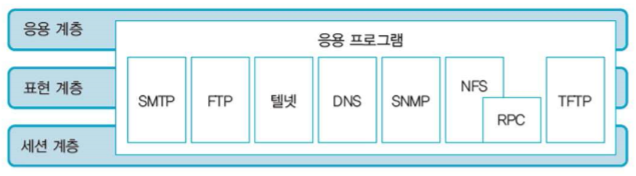

TCP/IP - Internet Layer (인터넷 계층)
---

* '네트워크 계층'이라고도 함
* 네트워크의 packet 전송을 제어, 데이터 전송 경로를 선택
* IP, ARP, ICMP, IGMP 프로토콜
* 송신 측 : 상위 계층에서 전달받은 packet에 IP주소를 포함하는 Header를 추가하여 하위 계층인 Data Link Layer로 전달 (encapsulation)
* 수신 측 : 하위 계층에서 전달받은 packet의 Header 정보를 확인한 후 송신 측의 Internet Layer에서 추가한 Header를 제거하여 상위 계층인 Transport Layer로 전달 (decapsulation)

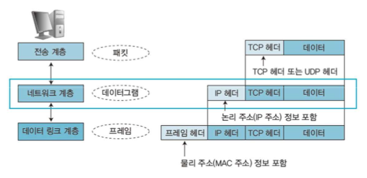

TCP/IP - Network Interface Layer (네트워크 인터페이스 계층)
---

* Data Link Layer의 역할을 하는 TCP/IP protocol에는 ethernet, 802.11X, MAC/LLC, SLIP, PPP 등 있음
* 송신 측 : 상위 계층에서 전달받은 packet에 **MAC 주소** 정보가 있는** Header를 추가**하여 Frame을 만든 후 Physical Layer로 전달
* 수신 측 : Data Link Layer에서 추가한 **Header를 제거**하여 상위 계층인 Network Layer로 전달
* Network Access Layer 라고도 함.

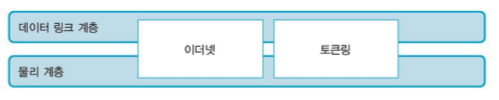

TCP/IP 주소의 구조
---

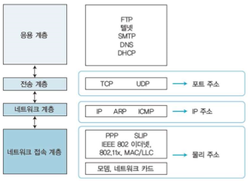

* 물리 주소 (MAC)
* IP 주소
  * 각 호스트를 식별할 수 있는 주소, Logical Address
* 포트 주소
  * 수신 컴퓨터의 응용 계층과 통신하기 위한 주소

TCP/IP Protocol Default Number & Frame 구성 흐름도
---

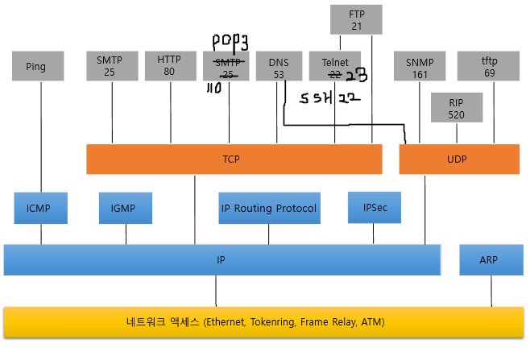

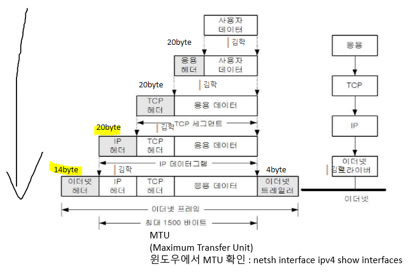

1. Protocol Stack 구조 : Protocol은 TCP 혹은 UDP를 사용
   * **TCP**는 신뢰성 통신. Data 송수신 여부를 확인한다. ---> Protocol 자체 오류 수정 가능   
    **UDP**는 비신뢰성 통신. Data 송수신 여부 확인을 하지 않음. ---> Protocol 자체 오류 수정 불가능

   * **TCP**를 사용하는 Protocol은 오류가 발생하면 오류 수정이 가능한 Application에서 사용됨
    **UDP**를 사용하는 Protocol은 오류가 발생하면 무시해도 되는 Applications에서 사용됨

   * **TCP**는 서버에 부하를 많이 줄 수 있음
    **UDP**는 보다 적은 부하를 줌

2. TCP/IP
   * TCP/IP 설계 시 큰 Data를 작은 Data로 나누고 재조립하여 다시 하나의 큰 Data로 완성시키는 형태의 통신 구조. 작게 나눈 Data 조각을 **Packet**이라고 함.
   * Default packet 단위는 **1500 Byte** (최소 64 Byte). Data를 쪼개는 단위를 **MTU**라고 함
   * 위 그림을 보면 MTU가 1500 Byte 이상을 넘어가면 Data를 쪼개서 전송한다는 의미.

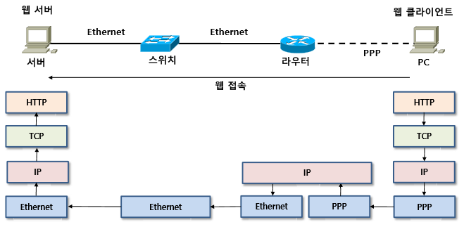

Ethernet Protocol
---

#### 주요 기능
1. 정보전달 : 인접 노드 간 데이터 전송
2. 회선제어 : 신호간 충돌이 발생하지 않도록 제어 (ENQ/ACK 기법, 폴링기법)
3. 흐름제어 : 송신자와 수신자 간 속도차 보상 (Stop and Wait, Sliding Window)
4. 오류제어 : 물리 전송 특성상 발생하는 오류와 잡음에 대한 보정 (FEC, BEC, ARQ)
5. 주소지정 : 송신자와 수신자의 물리주소 삽입 (MAC Address)
6. 접근제어 : 여러 시스템 연결 시, 링크 점유 시 사용 (CSMA/CD, CSMA/CA)

* Ethernet packet의 최소 길이는 64 Byte, 최대 길이는 1,518 Byte

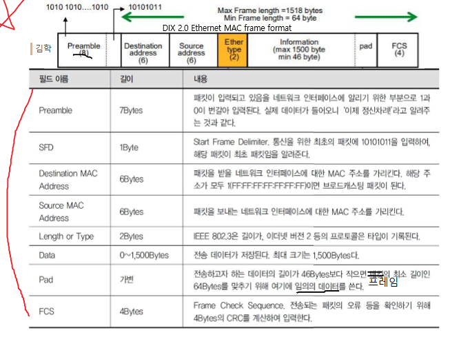

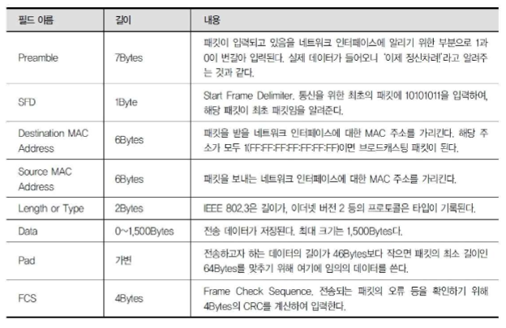

  * **Preamble**은 Data에서 제외
  * **Ether type** (2byte, 16bit) : 상위 계층의 Protocol이 무엇인지를 지정한 값(주소).
    (encapsulation : 상위계층이 알려주는 값, decapsulation : 상위계층을 어떤 protocol에 전달할지 결정하는 값)
    * **0x0800 : IPv4**
    * **0x0806 : ARP** 
    * **0x08DD : IPv6**

  * TCP와 UDP의 상위 Protocol이 무엇인지를 지정한 값의 역할은 **port 번호**로 지정됨

IP (Internet Protocol)
---

> 송신 호스트와 수신 호스트가 패킷 교환 네트워크 (Packet Switching Network)에서 정보를 교환하는 Protocol
> 인터넷에 연결된 모든 컴퓨터에 부여된 고유 주소 (현재는 IPv4 주소 체계를 사용)
* 3계층에서 호스트의 주소 지정과 packet 분할 및 조립

##### 1. IP 주요기능
   * 경로지정 Routing
   * IP 주소 지정 Addressing
   * Fragmentation(단편화), Defragmentation(재결합)  <--- Packet 분할, 조립
   * Capsulation

##### 2. IP 특징
   * 신뢰성 (error제어) 및 흐름제어 기능 없음 (Best-Effort Service)
   * 비연결성 Datagram 방식으로 전달되는 Protocol (Connectionnless)
   * Packet의 완전한 전달을 보장하진 않음 (Unreliable)
   * IP Header 내 Source 및 Destination Address를 포함
   * IP Header 내 Byte 전달 순서 : 최상위 Byte(MSB)를 먼저 보냄
   * MTU size보다 클 경우 Fragmentation이 필요함
   * **IPv4, IPv6**

* 각 Layer마다 Header가 존재하고 크기는 Protocol마다 다르다
  * L2 : ehternet 14byte Header + 4byte Tail
  * L3 : **IP** 20byte Header,**ICMP** 8byte Header, **ARP** 28byte Header
  * L4 : **TCP** 20byte, **UDP** 8byte
    ex) ICMP protocol : 보낸메시지 32byte + ICMP Header 8byte + IP Header 20byte + ethernet Header 14byte = 74byte

    ex)

    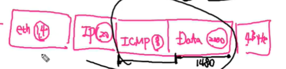

    - packet 1 : ethernet 14byte + IP 20byte + Data 1480byte + tail 4byte
    - packet 2 : IP 20byte + ICMP 8byte + Data 528byte

    (https://ddingz.tistory.com/161 패킷분할 참고)

##### 3. IPv4 Header와 IPv6 Header

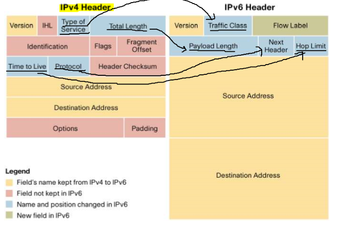

##### 4. IPv4 Header 구조

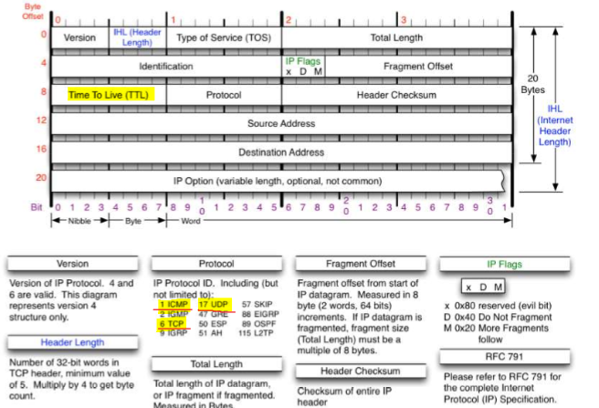

* **Version** : IPv4 (0100), IPv6 (0110)
* **IHL** (Header Length)은 IP Header의 크기 옵션
  * ex) 만약 IHL = 5 byte(0101)이면 IP Header의 크기는 5*4 = 20 byte (Default)   
      옵션이 있는 경우) IHL = 6 byte이면 IP Header의 크기는 5*5 = 25 byte

* **TOS** (Type Of Service) : IP 계층에서 지정하는 QoS (Quality of Service). 서비스의 우선 순위   
          현재 Diffserv 차등서비스 : DSCP 값을 사용
* **Total Length** (16bit) = IP packet의 Header + Data (전체 IP packet의 길이)
* **Identification** : IP packet의 ID. Fragmentation -> ID가 같으며 Fragment Offset을 이용해 재조립
* **Fragment Offset** (13bit) : 8byte Offset으로 조각에 저장된 원래 데이터의 byte 범위

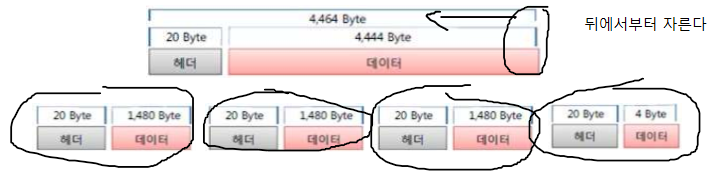

* **IP Flag**
  * 제어필드. 000 (3bit)로 제일 앞 0은 예약필드 (사용하지 않음)
  * 두번째 0은 Don't Fragmentation. 1 일 때 Fragmentation을 진행하지 않음 (방지)
  * 세번째 0은 More Fragments. 원래 데이터의 Fragmentation된 조각이 더 있는지 여부 판단.
    * Fragmentation이 진행된 경우 1로 변경되며 packet이 더 있다는 것을 나타냄.
* **TTL** (Time To Live) : packet 통신이 무한 Loop에 걸리는 것을 방지하는 것으로 통신이 Router를 통과할 때마다 1씩 감소하여 값이 0이 되면 폐기
  * TTL 값은 시스템마다 최초 값이 다르며 windows의 경우 128, Linux는 255 또는 64이다.
* **Protocol** : 상위 계층 protocol을 정의하고 IANA에 지정되어 있음. 0 ~ 25
  * **ICMP(1), IGMP(2), TCP(6), UDP(17)**
* **Header Checksum** : 오류 여부 판단. IP Header의 Checksum을 저장. ethernet의 FCS와 같은 기능
* **Source Address** (32bit) : 출발지 주소
* **Destination Address** (32bit) : 도착지 주소

***IP Header의 Default 크기는 20byte***

##### 5. IPv4 주소 체계

* IP주소 = Network ID + Host ID
  * Network ID가 같은 네트워크 = 같은 네트워크에 존재하며 Router없이 통신이 가능
  * Network ID가 다른 네트워크 = 다른 네트워크에 각각 존재하며 Router없이 통신 불가능
* IPv4의 IP주소는 2진수로 이루어진 32bit 주소 체계
* **Network주소** = Host ID가 전부 0인 주소
* **Broadcast 주소** = Host ID가 전부 1인 주소
* **Class 분류**
  * A class : 0.0.0.0 ~ 127.255.255.255 (subnet mask : 255.0.0.0)
  * B class : 128.0.0.0 ~ 191.255.255.255 (subnet mask : 255.255.0.0)
  * C class : 192.0.0.0 ~ 223.255.255.255 (subnet mask : 255.255.255.0)
  * D class : 멀티캐스트용 주소
  * E class : 예비용. 현재 사용되지 않음

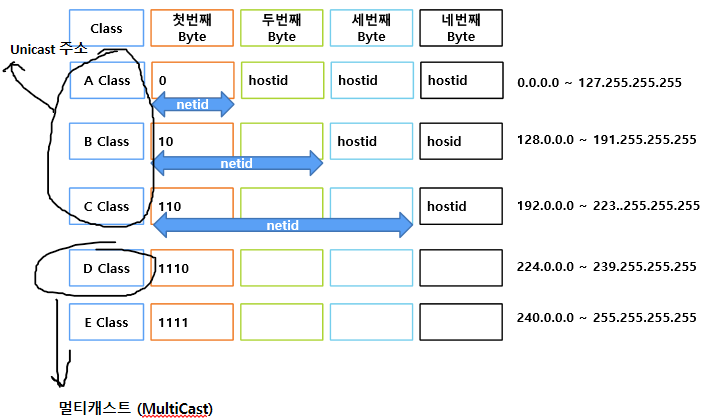

  * Unicast 1:1 통신
  * Multicast 1:n 통신 (Multicast 통신을 위한 management protocol은 **IGMP**)
  * Broadcast 1:all 통신
* 하나의 Interface에는 여러 개의 IP주소 지정이 가능하다

##### 6. Subneting

