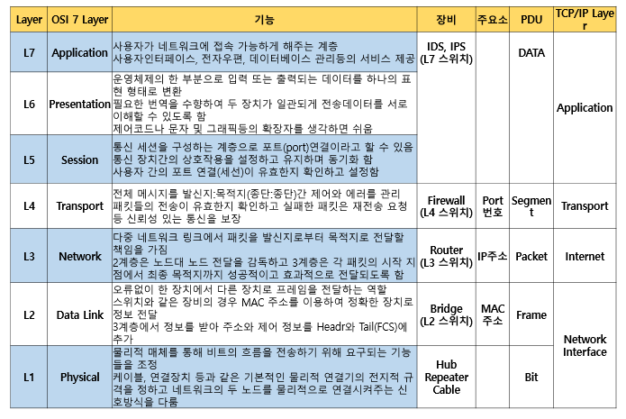

Layer Protocol
===

#### OSI L2 (TCP/IP 1계층)

##### 1. 참조
   * 네트워크(망) 연결 시 거리에 따른 분류
    **WAN**(Wide Area Network) : 국가 대 국가 ---> 광대역 통신망
    **MAN**(MetroPolitan Area Network) : 도시 간
    **LAN**(Local Area Network) : 건물 내 ---> 근거리 통신망
    **PAN**(Personal Area Network) : 개인 영역, Bluetooth

   * 연결 형태에 따른 분류
    버스형
    링형 : Token
    스타형 : 중앙집중 노드를 기준으로 연결 ---> 현재 가장 많이 사용하는 방식 (Hub)
    그물형(망형, mesh형) : 하나의 노드가 모든 노드와 연결된 형태

##### 2. Protocol
* WAN : x/25 -> ISDN -> FRAME RELAY -> DSL -> ATM -> MPLS
* LAN : ethernet, WLAN(무선랜), Bluetooth 등

##### 3. 특징
* OSI L1 : 신호전송(Media), 전기적 기계적 특성
* OSI L2 : 신호를 받아 시스템을 사용할 수 있거나 시스템에서 발생한 신호를 bit신호로 변경 후 전송
  * Hop-by-Hop 통신 (이웃한 장비와의 통신)
  * n : m (다대다) 통신을 위해 주소 부여

##### 4. 대표적인 주소
* ethernet의 MAC 주소는 48bit. 제조사에서 제품 생산 시 MAC주소가 결정됨
* 48bit => 24bit : 24bit
  * 앞 24bit는 OUI (Organization Unique Identification) : 제조사 번호 (IEEE에서 관리)
  * 뒤 24bit는 Serial ID : 제조사에서 부여하는 일련번호

#### OSI L3 (TCP/IP 2계층)

##### 1. Protocol
* **IP** 
* **ARP** (Address Resolution Protocol) : *IP주소로 MAC주소를 알아내는 Protocol*. IP주소와 MAC주소를 mapping할 수 있도록 해주는 ethernet의 핵심 Protocol이다.
* **ICMP** (Internet Control Message Protocol) : 네트워크 장치에서 네트워크 통신 문제를 진단하는 Protocol
  * 문제가 발생했을 때 해당 원인을 메시지를 통해 전달
  * IP주소를 이용해 Source -> Destination까지 정상적으로 L3를 통해 통신 여부를 확인하는 목적으로 주로 사용 (오류 보고)
* **IGMP** (Internet Group Management Protocol) : 여러 장치가 하나의 IP주소 **(Multicast IP 주소 대역)** 를 공유하여 모두 동일한 데이터를 수신하는 Protocol.   
  Multicast에 반드시 필요한 Protocol
* **Routing Protocol**
  RIP, EIGRP, OSPF, IS-IS, BGP
  : Router끼리 자신이 알고 있는 경로와 모르는 경로를 서로 정보를 교환하여 경로 정보를 업데이트하는 Protocol

##### 2. 특징
* Best-effort Service (최대한 빠르게)
* Best path (최적의 경로)
* 주소 지정 (논리 주소 부여)
* 비신뢰성, 비연결성
* 분할, 재조립

##### 3. IP주소
* IPv4 : 32bit (전송방식 : Unicast, Multicast, Broadcast)
* IPv6 : 64bit (전송방식 : Unicast, Multicast, Anicast)

#### OSI L4 (TCP/IP 3계층)

##### 1. Protocol
* **TCP** (Transmit Control Protocol) : 연결지향형, 신뢰성, 흐름 및 오류제어, 분할/재조립, 3-way handshake, 4-way handshake, Sliding windows 기법, slow start
* **UDP** (User Datagram Protocol) : 비연결지향, 비신뢰성, 분할

##### 2. Port 주소
> 16bit 주소체계. port번호 : tcp,udp **0 ~ 65535**
* (하나의 시스템에서) 같은 Protocol이 같은 Port번호를 점유할 수 없음
* Default port 주소의 경우 port번호를 쓰지 않아도 됨
* TCP/IP 통신을 하는 서비스의 경우 서비스는 1개 이상의 Port를 사용할 수 있음

#### OSI L7 (TCP/IP 4계층 -> OSI L5, L6, L7 포함)
##### 1. Protocol
1. **http** (80/tcp) : 웹(www)서비스 데이터를 평문 전송
2. **https** (443/tcp) : 웹(www)서비스 데이터를 암호화 전송
3. **ftp** (21/tcp, ftp-date는 20/tcp) : 파일 전송 프로토콜. 사용자 ID와 PW가 있어야 사용 가능.
    (ID, PW없이 사용하려면 anonymous 계정을 활성화해서 사용)
4. **tftp** (69/udp) : trivial FTP. 간단한 파일 전송.
   * 사용자 ID와 PW없이 사용 가능.
   * system 환경설정 백업, system 부팅 파일 백업 및 전송 등에 많이 사용
5. **dns** (53/udp 사용자query, 53/tcp는 서버 사이의 동기화,백업)
   * 도메인주소 (ex. www.naver.com 등)
   * domain name service
6. **ntp** (123/udp) : Network Time Protocol
   * 네트워크에 연결된 장비들 간의 시간 동기화를 위한 Protocol
   * Log는 시간을 기준으로 작성되기 때문에 시스템 or 네트워크 장비의 시간 설정은 매우 중요
7. **dhcp** (67/udp는 Server의 Port. 68/udp는 Client의 Port) : Dynamic Host Configure Protocol
   * IP가 없는 장비에 IP를 자동으로 지정하는 Protocol
   * Dynamic -> 특정 Protocol을 이용해 시스템끼리 정보교환 후 알아서 설정
   * Static -> 관리자가 직접 설정
8. **e-mail** Protocol
   * 전송 : **SMTP** (25/tcp) : send mail transfer protocol
   * 수신 : **POP3** (110/tcp) : port office protocol. 받은 메일을 가져옴
            **IMAP** (143/tcp) : Internet message access protocol. 메일 보관함의 폴더 구조 등을 연동
9. **SNMP** (161/udp) : Simple Network Management Protocol
    * SNMP 서버에 Client 장비가 자신의 하드웨어 성능과 같은 정보를 주기적으로 보내 SNMP 서버가 모니터링을 할 수 있도록 하는 Protocol
    * 네트워크 장비의 Traffic을 그래프로 보여주는 프로그램 : MRTG

10. **GUI 원격접속** Protocol
    * **RDP** (3389/tcp) : Remote Desktop Protocol. Linux에서도 사용 가능
    * **VNC** (5900/tcp) : OpenSource로 개발한 원격접속 Protocol

11. **CLI 원격접속** Protocol
    * **SSH** (22/tcp) : 데이터 암호화 전송
    * **Telnet** (23/tcp) : 데이터 평문 전송

12. **OpenSource Database**
    * **MYSQL**(=MariaDB) 3306/tcp
    * **MSSQL** (1443/tcp) : MS에서 만든 DB
    * **Oracle** (1521/tcp)
        > https://docs.oracle.com/cd/B28196_01/install.1014/b32106/ports.htm 참고
    * **PostgreSQL** (5432/tcp)

##### Service port의 주소는
Windows는 c:\windows\system32\drivers\etc Directory에 *services*라는 파일에 저장되었음
Linux는 /etc Directory에 *services*라는 파일에 저장되었음

