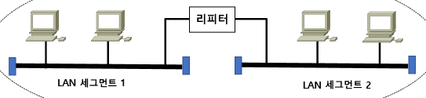
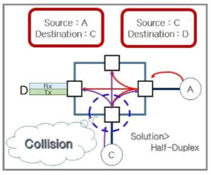

Layer Equipment (계층별 장비)
===

1계층
---

> bit 형태의 신호에 패턴을 부여하여 전기적 신호로 변경 후 전송하는 계층

* 대표적 장비 : 케이블, Connector, Repeater, Hub 등
* 케이블
  * 동축케이블 (Coaxial Cable)
  * TP(Twisted Pair) 케이블
  * 광케이블

#### Carrier (반송파)
> 시스템에서 생성된 bit 신호는 미약하기 때문에 멀리 떨어진 곳으로 신호를 보내기 위한 증폭과 오류를 줄이기 위해서 신호를 확실하게 구분하려는 목적으로 변조를 진행한 신호

  * 이 신호는 원래의 bit신호를 합성하여 전달하고 수신하는 곳은 Carrier 신호를 삭제하면 원래의 bit신호를 확인할 수 있음
  * 전송 매개체, 전송매체(media) : 케이블, 주파수
    (전송 매체만 존재하면 모든 방향으로 전달)

#### Repeater

> 하나의 LAN에 속하는 segments를 연결하여 LAN의 거리를 늘려주고 증폭시키는 역할

#### Hub (Dummy Hub, Multiport Repeater)
* Hub는 운영체제가 존재하지 않고 유입된 신호를 나머지 다른 포트로 전달 (Flooding)
* Flooding 특성으로 인해 신호를 증폭하여 전달하는 과정 중 충돌(Collision) 발생
* 위와 같은 이유로 Rx에서 신호를 감지하면 Tx로 신호를 보내지 않음 (Half Duplex)

* 동시 통신 불가능
  * 동시에 Rx, Tx 또는 다른 장비가 동시에 통신할 수 없는 충돌영역(Collision Domain)이 발생
  * Half Duplex : 일종의 무전기와 같은 단방향 통신 방식
  * Full Duplex : 두 디바이스간 통신선이 2개가 존재하여 데이터 송수신이 동시에 가능
  * Hub가 계속 연결되면 충돌영역은 커진다

* 통신 거리를 늘리기 위해 여러 Repeater를 사용하면 잡음 신호까지 증폭되어 원래 신호가 다른 신호로 변질될 수 있는 문제가 발생할 수 있음
  위 문제를 해결하기 위해 **3:4:5 Rule** 적용을 권장
  * Repeater 3개, 연결회선(media) 4개, 장비 5개  --> 최소 frame size 64byte

* 