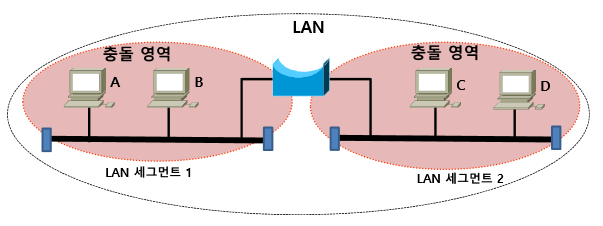

Layer Equipment (계층별 장비)
===

1계층
---

> bit 형태의 신호에 패턴을 부여하여 전기적 신호로 변경 후 전송하는 계층

* 대표적 장비 : 케이블, Connector, Repeater, Hub 등
* 케이블
  * 동축케이블 (Coaxial Cable)
  * TP(Twisted Pair) 케이블
  * 광케이블

#### Carrier (반송파)
> 시스템에서 생성된 bit 신호는 미약하기 때문에 멀리 떨어진 곳으로 신호를 보내기 위한 증폭과 오류를 줄이기 위해서 신호를 확실하게 구분하려는 목적으로 변조를 진행한 신호

  * 이 신호는 원래의 bit신호를 합성하여 전달하고 수신하는 곳은 Carrier 신호를 삭제하면 원래의 bit신호를 확인할 수 있음
  * 전송 매개체, 전송매체(media) : 케이블, 주파수
    (전송 매체만 존재하면 모든 방향으로 전달)

#### Repeater

> 하나의 LAN에 속하는 segments를 연결하여 LAN의 거리를 늘려주고 증폭시키는 역할

#### Hub (Dummy Hub, Multiport Repeater)
* Hub는 운영체제가 존재하지 않고 유입된 신호를 나머지 다른 포트로 전달 (Flooding)
* Flooding 특성으로 인해 신호를 증폭하여 전달하는 과정 중 충돌(Collision) 발생
* 위와 같은 이유로 Rx에서 신호를 감지하면 Tx로 신호를 보내지 않음 (Half Duplex)

* 동시 통신 불가능
  * 동시에 Rx, Tx 또는 다른 장비가 동시에 통신할 수 없는 충돌영역(Collision Domain)이 발생
  * Half Duplex : 일종의 무전기와 같은 단방향 통신 방식
  * Full Duplex : 두 디바이스간 통신선이 2개가 존재하여 데이터 송수신이 동시에 가능
  * Hub가 계속 연결되면 충돌영역은 커진다

* 통신 거리를 늘리기 위해 여러 Repeater를 사용하면 잡음 신호까지 증폭되어 원래 신호가 다른 신호로 변질될 수 있는 문제가 발생할 수 있음
  위 문제를 해결하기 위해 **3:4:5 Rule** 적용을 권장
  * Repeater 3개, 연결회선(media) 4개, 장비 5개  --> 최소 frame size 64byte

* Carrier Sense Multiple Access (CSMA, 반송파 감지 다중 액세스)
  * 신호 충돌을 회피하기 위한 기법 중 하나. 
    * Ethernet **CSMA/CD** (Collision Detection : 충돌감지)
    * WLAN **CSMA/CA** (Collision Avoidance : 충돌회피)

#### 충돌 영역 (Collision Domain)
* 동시에 신호를 보낼 때 충돌이 일어나는 영역
* Hub가 계속 연결되면 충돌영역은 커진다.

2계층
---
> 1계층의 충돌영역이 커지면 발생되는 통신 불가 현상과 시스템 자원 소모 현상을 줄이기 위해 **충돌영역을 분리**시켜주는 역할

> 2계층은 Broadcast를 이용하여 모든 장비와 통신할 수 있지만 이 Broadcast는 1계층과 똑같은 통신으로 작용하기 때문에 Broadcast domain(영역)을 줄여야 통신이 원할 (Broadcast 대상으로 Filtering 불가능 --> 3계층 장비에서 가능)

* 인접 장비에 접근하기 위한 정보(MAC)를 부여해 Node간 연결성 보장
* 대표적 장비 : Bridge, Switch
* 다른 장치로 Frame을 전달하는 역할
* 오류 없는 전달을 위한 2계층 제어의 종류
  * 오류제어
    * 전송프레임에서 발생한 에러를 검출하고 정정
    * 순방향 오류제어(FEC), 역방향 오류제어(ARQ), Hybrid
  * 흐름제어
    * 두 Node(단말)간 처리속도 차이에 의한 데이터 손실을 방지하기 위해 전송량, 전송속도를 제어
    * ARQ, Sliding Windows
  * 회선제어
    * 다수의 Node가 하나의 회선을 공유하는 방법
    * 경쟁방식, 폴링방식, 인터럽트방식, 토큰방식
  * 혼잡제어
    * 네트워크의 혼잡 발생 시 송신측에서 데이터 손실을 방지하기 위해 데이터 전송량과 속도 조절
    * One loop 제어, Closed loop 제어

#### Bridge
* 네트워크에서 Collision Domain 나누기
* 다른 segment 간 frame 전달, 동일 segment 간 frame 차단
* 충돌영역 장비간 MAC주소를 확인 후 통과, 충돌영역 사이 통과 여부 판단
* 현재는 Switch 장비가 Bridge 역할을 하기 때문에 사용하지 않음

#### Switch
> Hub처럼 모든 port로 Flooding하지 않고 해당 장비로 전달 (Forwarding + Filtering)

* MAC주소로 신호 통과 여부를 판단
* MAC 주소를 다음과 같은 방식으로 판단
  * Learning : 각 장비의 MAC Address를 읽어 **MAC Address Table**에 저장
  * Flooding : MAC Address Table에 저장되어 있지 않을 경우 모든 port로 신호 전달
  * Forwarding : 해당 MAC Address를 가진 port에 전달
  * Filtering : 다른 port에 전달하지 못하도록 차단
  * Aging : MAC Address Table의 크기가 너무 커지는 것을 방지

* 각 계층별 장비는 각각 header를 읽거나 capsulation을 하는 기능이 있음
  * Stack구조 : 상위 계층 장비는 하위 계층의 역할을 수행할 수 있음 ---> 3계층에서 2계층의 충돌 영역 분리도 가능함
* BUM traffic
  * Broadcast : 2계층의 Broadcast 주소 : ff:ff:ff:ff:ff:ff
  * Unknown Unicast : Switch에 학습되지 않은 Unicast 주소
  * Multicast : 2계층의 Broadcast 주소 01:00:5e로 시작

3계층
---

