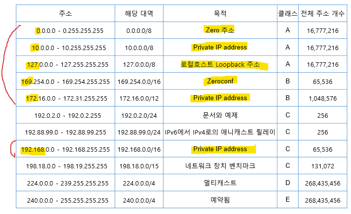

IP Address
===

> TCP/IP는 프로토콜을 사용하는 모든 장비들을 구분하기 위해 만든 논리적인 주소
> 32bit
> Network ID + Host ID

* Network ID가 같을 때 Router 없이 통신이 가능한 Broadcast Domain이 됨
* 하나의 Network에 속한 장비의 Host ID는 서로 달라야 한다 (중복될 경우 IP충돌)

#### IPv4 주소 형식
* 2진 표기법
  ex) 11000000 10101000 00000001 00011111
* 10진 표기법
  ex) 192.168.1.31
* 2진수 표기법에서 8개 = 1 octet


IPv4 Class
---

* 각 Class에서 실제 Host에 사용되는 IP는 Network Address, Broadcast Address를 제외한 나머지 IP.

> Network Address : Host ID 부분이 전부 0
> Broadcast Address : Host ID 부분이 전부 1


#### *특수한 IP주소*

##### Loop back address
* 127.x.x.x
* 보통 127.0.0.1 을 사용 = **localhost**(hosts 파일에 등록)
* 실제 인터넷에서 사용되거나 host에 설정되는 네트워크가 아니라 테스트 목적인 네트워크 대역
* TCP/IP가 정상적으로 작동하는지 여부 등을 판단할 때 사용되는 IP 대역
* TCP/IP protocol을 사용한 Application 등을 테스트 (정상 작동 여부)


##### Private IP
* 인터넷 연결없이 TCP/IP를 사용하기 위해 주어진 네트워크 대역
* Routing 되지 않는 IP 대역
* Class A : 10.0.0.0 ~ 10.255.255.255 (10.0.0.0/8)
* Class B : 172.16.0.0 ~ 172.31.255.255 (172.16.0.0/12)
* Class C : 192.168.0.0 ~ 192.168.255.255 (192.168.0.0/16)
  (Internet에서 위 IP주소들은 Routing X)

##### Zeroconf address
* 169.254.0.0 ~ 169.254.255.255 (169.254.0.0/16)
* IP 자동할당 했을 때 IP를 정상적으로 받지 못한 경우에 TCP/IP 통신을 하기 위해 설정되는 IP주소
* Router와 Router 간 1:1 연결을 하거나 VPN을 1:1 연결 시에 사용하기도 함

##### Zero address
*** 0.0.0.0/8**은 모든 IP주소의 대표 주소인 **0.0.0.0/0 (즉, 모든 IP주소)**를 사용하기 때문에 IP주소로 사용하지 못하는 네트워크 대역이다.

##### D, E Class
* D class는 IP주소 1개가 Multicast 서비스 하나의 IP다. (장비에 주소를 등록하지 않음)
* E class는 사용하지 않음




Subnet Mask
---

> 큰 네트워크를 작은 단위로 나누어 사용
> Broadcast domain 분할
> IP주소와 Subnet mask를 AND 연산을 하면 Network주소이다.

1. Subnet mask에서 1은 IP주소가 변하지 않는 Network ID 부분
2. Subnet mask에서 0은 호스트 ID 부분
3. Subnet mask 값은 연속된 0 혹은 1
4. 0으로 시작한 경우 중간에 1이 올 수 없다


#### Default Mask
> Class 별 Default Mask

##### A class
11111111 00000000 00000000 00000000
255.0.0.0
**/8** (prefix)

##### B class
11111111 11111111 00000000 00000000
255.255.0.0
**/16**

##### C class
11111111 11111111 11111111 00000000
255.255.255.0
**/24**


Subnetting
---

##### Subnet mask 관련 2진수 중요!!!
```
10000000 = 128
11000000 = 192
11100000 = 224
11110000 = 240
11111000 = 248
11111100 = 252
11111110 = 254
11111111 = 255
```

#### 서브넷마스크에 의한 IP 수
```
ex) /16 = 255.255.0.0 = 11111111.11111111.00000000.00000000
총 네트워크 수 : 1개
총 IP수 : 2^16개 = 65,536개
```
```
ex) /17 = 11111111.11111111.10000000.00000000 = 255.255.128.0
총 네트워크 수 : 2개
각 네트워크 당 IP수 : 2^15개 = 32,768개
```
```
ex) /16 -> /18로 변경
= 255.255.192.0
11111111.11111111.11000000.00000000
총 네트워크 수 : 4개
각 네트워크 당 IP수 : 2^14개 = 16,384개
```
```
ex) 10.10.10.10/20 (서브넷마스크 : 255.255.240.0)
Network 주소 : 10.10.0.0
Broadcast 주소 : 10.10.15.255
---> 10.10.0.0 ~ 10.10.15.255
```
```
ex) 20.20.20.20/22 (255.255.252.0)
= 20.20.00010100.00010100 /22
Network 주소 : 20.20.00010100.00000000 = 20.20.20.0
Broadcast 주소 : 20.20.00010111.11111111 = 20.20.23.255
---> 20.20.20.0 ~ 20.20.23.255
```
```
ex) 100.100.100.100/26 (255.255.255.192)
= 100.100.100.01100100 /26
Network 주소 : 100.100.100.01000000 = 100.100.100.64
Broadcast 주소 : 100.100.100.01111111 = 100.100.100.127
--->  100.100.100.64 ~ 100.100.100.127
```

#### 다른 계산법 (더 간단)

```
ex) 64.53.172.102/26 (255.255.255.192)
하나의 네트워크에 IP주소는 2^6개 = 64개

102/64 = 1.xxxx     --->      Network 주소 : 64.53.172.64
Broadcast 주소 : 64.53.172.127(64+64-1)
---> 64.53.172.64 ~ 64.53.172.127
```
```
ex) 70.239.169.114/27 (255.255.255.224)
하나의 네트워크 당 Host주소는 2^5개 = 32개

114/32 = 3.xxxx     --->      Network 주소 : 70.239.169.96 (32*3)
Broadcast 주소 : 70.239.169.127(96+32-1)
---> 70.239.169.96 ~ 70.239.169.127
```
```
ex) 67.14.102.107/19
(세번째 octet만 생각)
각 네트워크 당 Host주소는 2^5개 = 32개

102/32 = 3.xxxx     --->      Network 주소 : 67.14.96.0
Broadcast 주소 : 67.14.127.255
---> 67.14.96.0 ~ 67.14.127.255
```
```
ex) 90.88.42.236/15
각 네트워크 당 Host주소는 2^1개 = 2개

88/2 = 44     --->      Network 주소 : 90.88.0.0
Broadcast 주소 : 90.89(88+2-1).255.255
---> 90.88.0.0 ~ 90.89.255.255
```
```
ex) 162.111.50.86/22
각 네트워크 당 Host주소는 2^2개 = 4개

50/4 = 12.xxx     --->      Network 주소 : 162.111.48.0
Broadcast 주소 : 162.111.51(48+4-1).255
---> 162.111.48.0 ~ 162.111.51.255
```

* **Subnetting**은 주어진 Network 범위에서 Host ID부분을 빌려와서 Subnet mask 값을 증가
  즉, 큰 네트워크를 작은 네트워크 범위로 분할하여 사용
  * Subnet ID : 원래 있던 Subnet mask 값에서 늘어난 Subnet mask 값의 차이
    2^subnet ID 만큼 네트워크가 분리됨

```
ex) /20 서브넷을 가진 네트워크 ---> /21로 Subnetting 했을 경우
Subnet ID = 1     --->      2^1개의 네트워크로 분할
```
```
ex) /20 ---> /23
Subnet ID = 3     --->      2^3개의 네트워크로 분할
```
```
ex) 129.176.237.56/25 를 4개의 네트워크로 분할하고 각 범위를 구하라.

= 129.176.237.00111000/25 ---> 129.176.237.00111000/27

129.176.237.000 00000 ~ 129.176.237.000 11111 ---> 129.176.237.0 ~ 129.176.237.31
129.176.237.001 00000 ~ 129.176.237.001 11111 ---> 129.176.237.32 ~ 129.176.237.63
129.176.237.010 00000 ~ 129.176.237.010 11111 ---> 129.176.237.64 ~ 129.176.237.95
129.176.237.011 00000 ~ 129.176.237 011 11111 ---> 129.176.237.96 ~ 129.176.237.127

혹은

/27 에서 Host 주소는 2^5개 = 32개

129.176.237.0 ~ 129.176.237.31
129.176.237.32 ~ 129.176.237.63
129.176.237.64 ~ 129.176.237.95
129.176.237.96 ~ 129.176.237.127
```
```
ex) 189.54.131.192/20 를 4개의 네트워크로 분할

/20 --> /22
189.54.100000 11.192

(189.54.100000 00.0 =) 189.54.128.0 ~ (189.54.100000 11.255 =) 189.54.131.255
(189.54.100000 01.0 =)
(189.54.100000 10.0 =)
(189.54.100000 11.0 =)

혹은

131/2^4개 = 8.xxxx
Network 주소 : 189.54.128(16*8).0 부터 시작
이제 /22로 Subnet mask가 바뀌면 Host주소는 2^2개 = 4개

189.54.128.0 ~ 189.54.131.255
189.54.132.0 ~ 189.54.135.255
189.54.136.0 ~ 189.54.139.255
189.54.140.0 ~ 189.54.143.255
```

#### octet 다를 때 IP계산

```
ex) 88.241.6.28 /22 -> /26

1. 우선 /22 -> /24
Host주소는 2^2개 = 4개
6/4 = 1.xxx

88.241.4.0/24
88.241.5.0/24
88.241.6.0/24
88.241.7.0/24

2. -> /26
Host주소는 2^6개 = 64개

88.241.4.0 --->  88.241.4.0/26 ~
                 88.241.4.64/26 ~
                 88.241.4.128/26 ~
                 88.241.4.192/26 ~
88.241.5.0 --->  ...
88.241.6.0 --->  ...
88.241.7.0 --->  ...
```

```
ex) 173.110.46.198/17 -> /27

우선 /17 -> /24
Host주소는 2^7개 = 128개

173.110.0.0/17 ~ 173.110.127.255/17 에서

173.110.0.0/24
173.110.1.0/24
...
173.110.127.0/24

여기서 다시 /24 -> /27
```

```
ex) 40.60.195.170/22 -> /26

우선 /22 -> /24 (Host 주소 4개)
195/4 = 48.xxx  ---> 40.60.192(48*4).0 부터 시작

40.60.192.0/24
40.60.193.0/24
40.60.194.0/24
40.60.195.0/24

/24 -> /26
Host 주소는 2^6개 = 64개

40.60.192.0 ~
40.60.192.64 ~
40.60.192.128 ~
40.60.192.192 ~

40.60.193.0 ~
40.60.193.64 ~
40.60.193.128 ~
...
40.60.195.192 ~ 40.60.195.255
```
```
ex) 111.200.200.200/14 -> /18

우선 /14 -> /16
(2^2=4개 ---> 200/4=50 으로 딱 맞아떨어져서 시작은 200 그대로)

111.200.0.0/16
111.201.0.0/16
111.202.0.0/16
111.203.0.0/16

/16 -> /18
Host 주소 = 2^6개 = 64개

111.200.0.0/18 ~
111.200.64.0/18 ~
111.200.128.0/18 ~
111.200.192.0/18 ~

111.201.0.0/18 ~
111.201.64.0/18 ~
111.201.128.0/18 ~
111.201.192.0/18 ~
...
111.203.192.0/18 ~ 111.203.255.255
```

#### Supernetting (슈퍼넷팅)

> 하위클래스 -> 상위클래스
> C class -> B class -> A class

> C class 4개의 네트워크를 하나의 네트워크로 묶어서 사용할 수 있음
> A, B class 주소가 고갈되고 C class 주소만 남아있는 상태

* Classful
> 원래의 Class 형태를 유지해서 사용하는 Subnet mask 값 (Major Network)

* Classless
  * 원래의 Class 형태는 없어지고 Subnet mask 값을 이용하여 네트워크를 분리

  * **FLSM (Fixed Length Subnet Mask)** : Major Network를 고정된 크기의 subnet mask로 나눈 것
  * **VLSM (Variable Length Subnet Mask, RFC1519)** : Major Network를 가번적인 크기의 Subnet으로 나누어 생성
    * 네트워크 분할 시 가용IP를 고려하여 분할
  * **CIDR (Classless Inter Domain Routing, RFC1519)** : Class형 주소 체계를 여러 개로 나누거나 합침
    * 작은 네트워크를 하나의 큰 네트워크로 합쳐서 주로 Supernet에서 사용. 이런 Supernet을 CIDR이라고 함.
    * Major Network를 크거나(Supernet) 작게(Subnet) 한 네트워크에 대한 집합화
    * 현재는 Subnet, Supernet을 구분하지 않고 **Subnetting**이라고 통용
      Supernet은 주로 Routing 할 때 네트워크 축약할 때 사용
    * /8, /16, /24 (prefix) 표기 ---> CIDR에서 정의 ---> CIDR 표기법

VLSM (Variable Length Subnet Mask)
---

> 가장 큰 Host를 가진 범위부터 Subnetting 후 나머지 네트워크로 다음 큰 Host 범위를 주는 형태로 Subnetting 진행

```
ex) 200.200.200.0/24 네트워크를 가진 회사에
관리부 : 5개 IP
영업부 : 60개 IP
총무부 : 20개 IP
개발부 : 50개 IP
기획부 : 20개 IP     각각 할당

---> 많은 IP를 요구하는 부서부터 처리

영업부(60개) -> 200.200.200.0/26 ~ 200.200.200.63/26
개발부(50개) -> 200.200.200.64/26 ~ 200.200.200.127/26
총무부(20개) -> 200.200.200.128/27 ~ 200.200.200.159/27
기획부(20개) -> 200.200.200.160/27 ~ 200.200.200.191/27
관리부(5개)  -> 200.200.200.192/28 ~ 200.200.200.207/28
              혹은 200.200.200.192/26 ~ 전부 IP 부여 가능
```

```
ex) 172.16.0.0/24 네트워크를 소유한 회사
서버 : 120대 소유
기술부 : 60대
회계부 : 20대
영업부 : 16대

서버(120대) -> 172.16.0.0/25 ~ 172.16.0.127/25 (가용IP 126대)
기술부(60대) -> 172.16.0.128/26 ~ 172.16.0.191/26 (가용IP 62대)
회계부(20대) -> 172.16.0.192/27 ~ 172.16.0.223/27 (가용IP 30대)
영업부(16대) -> 172.16.0.224/27 ~ 172.16.0.255/27
  * 영업부에서 /28로 Subnetting 할 수 없는 이유 : 전체 IP 중 Network주소와 Broadcast주소를 뺸 나머지 IP가 바로 가용IP
  * 만약 /28로 subnetting 하면 가용IP는 14대 ---> IP주소 부족
```

```
ex) 192.168.2.0/23 네트워크를 가진 회사
서버 250대
본사 120명
인천지사 32명
광주지사 20명
부산지사 30명

서버(250대) -> 192.168.2.0/24 ~ 192.168.2.255/24 (가용IP 254대)
본사(120명) -> 192.168.3.0/25 ~ 192.168.3.127/25 (가용IP 126대)
인천지사(32명) -> 192.168.3.128/26 ~ 192.168.3.191/26 (가용IP 62대)
부산지사(30명) -> 192.168.3.192/27 ~ 192.168.3.223/27 (가용IP 30대)
광주지사(20명) -> 192.168.3.224/27 ~ 192.168.3.255/27 (가용IP 30대)
```
